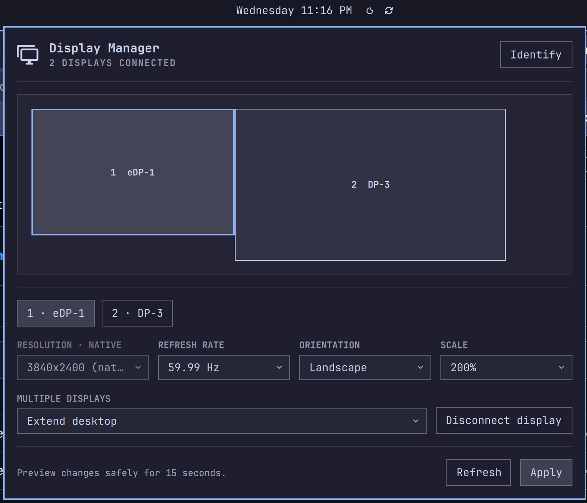

# Omarchy Display Manager

A native Omarchy Quickshell companion for arranging and configuring multiple
monitors with the ease of Windows Display Settings.

<p align="center">
  
</p>

## Features

- Drag displays into position on a visual desktop canvas.
- Identify each physical display with a numbered full-screen overlay.
- Choose resolution, refresh rate, orientation, and valid fractional scales.
- Extend, duplicate, connect, and disconnect displays.
- Preview every change with a 15-second automatic rollback.
- Save a default profile for each exact dock or monitor topology.
- Automatically restore the matching profile after a hotplug or login.
- Follow the active Omarchy theme through the shell's shared UI components.

The plugin is an advanced companion to Omarchy's built-in Display widget. It
does not replace brightness or global text-size controls and does not modify
`~/.config/hypr/monitors.lua`.

## Requirements

- Omarchy 4 (Quattro) with its bundled Quickshell plugin host
- Hyprland 0.55 or newer
- `hyprctl`, `jq`, `socat`, systemd user services, and
  `omarchy-notification-send` (all included with Omarchy)

The plugin needs no root privileges and installs no additional packages.

## Install

```bash
omarchy plugin add https://github.com/Bmontythe3rd/omarchy-display-manager.git --enable
```

It is placed in the bar's right section by default. Open its multi-monitor icon
next to Omarchy's built-in Display control.

For local development:

```bash
omarchy plugin add /absolute/path/to/omarchy-display-manager --enable
omarchy restart shell
```

## Update

Installed copies are git-managed. Review and install the latest upstream
changes with:

```bash
omarchy plugin update io.github.bmontythe3rd.display-manager
```

The community marketplace reads this repository's `main` branch during its
daily catalog refresh, so existing listings do not need to be resubmitted for
each release. Users still choose when to update their installed copy.

## Use

1. Select a display by clicking its canvas tile or selector.
2. Drag tiles to match the physical arrangement and choose display settings.
3. Click **Apply**. If the result is usable, click **Keep changes** within 15
   seconds; otherwise choose **Revert** or wait for automatic recovery.
4. Kept changes are saved as the automatic `Default` profile for the connected
   display set. Reconnecting that exact set applies the profile automatically.

Profiles are stored at
`${XDG_STATE_HOME:-~/.local/state}/omarchy-display-manager/profiles.json`.
Removing the plugin does not remove this user data.

## Remove

```bash
omarchy plugin remove io.github.bmontythe3rd.display-manager --yes
```

Optionally remove saved profiles:

```bash
rm -r "${XDG_STATE_HOME:-$HOME/.local/state}/omarchy-display-manager"
```

## Safety and privacy

Display settings are applied locally through `hyprctl`. No telemetry or network
requests are made. A pending layout is stored locally and a transient systemd
user timer restores it after 15 seconds. The plugin refuses configurations that
disable every monitor, contain duplicate or overlapping extended displays,
target invalid mirrors, or omit required mode and scale values. Applied layouts
are checked against Hyprland's live state before they can be confirmed or saved.

As with all community plugins, inspect the source before installation. Omarchy
plugins run as the current user and are not sandboxed.

## Development

```bash
tests/run.sh
qmllint -I /usr/share/omarchy/shell DisplayManager.qml ProfileService.qml IdentifyOverlay.qml
```

The test suite uses a mocked `hyprctl`; it never changes the active display
layout. Continuous integration runs the model, manifest, helper, and shell
syntax checks for every pull request and push to `main`. See
[CHANGELOG.md](CHANGELOG.md) for release history.

## License

[MIT](LICENSE)
